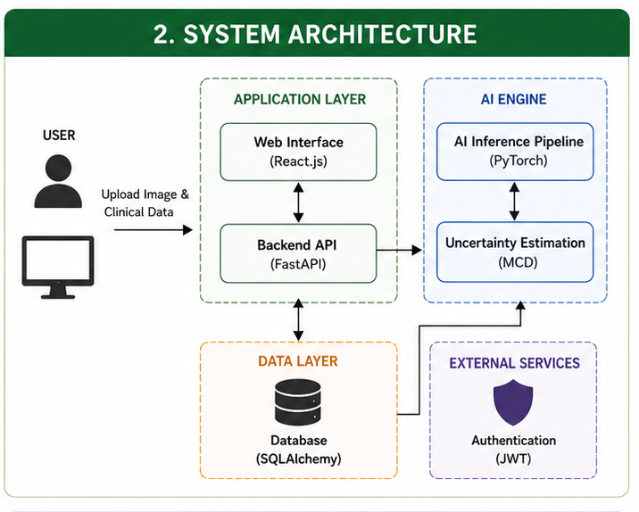
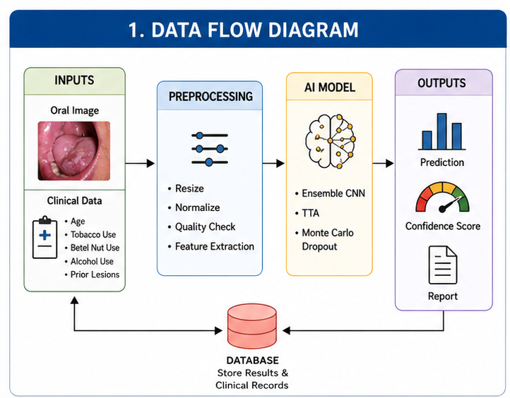
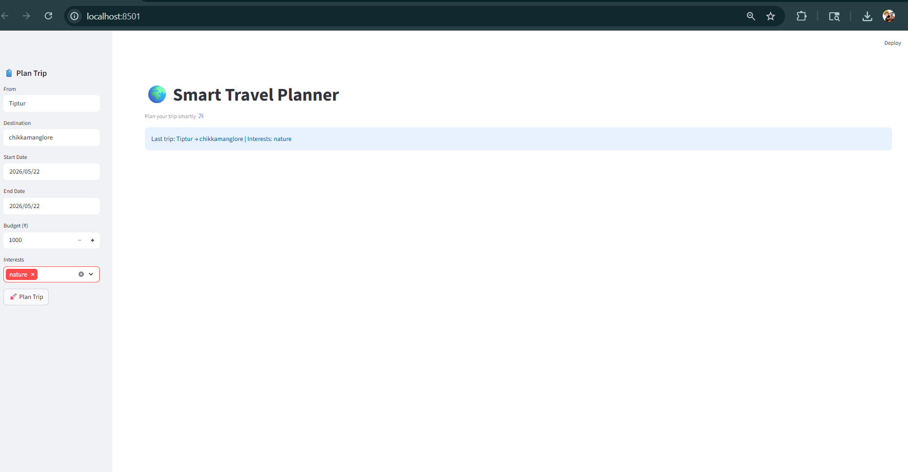
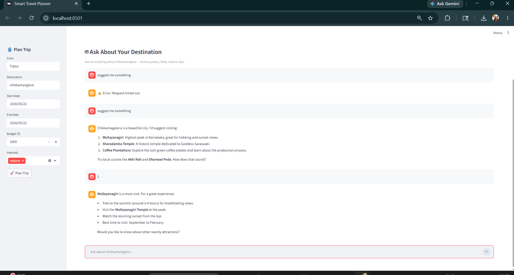
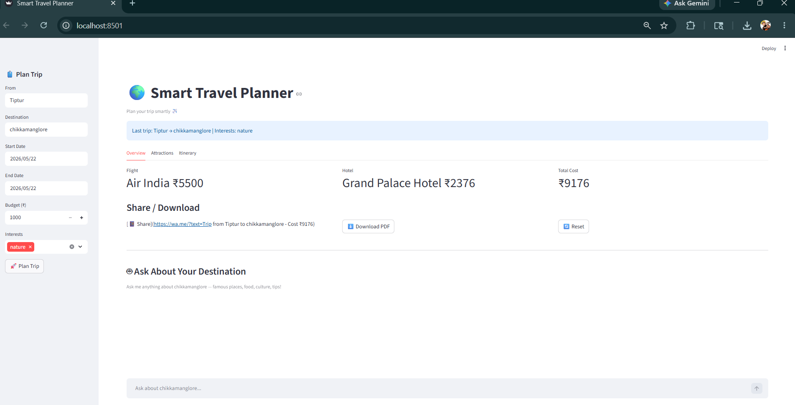
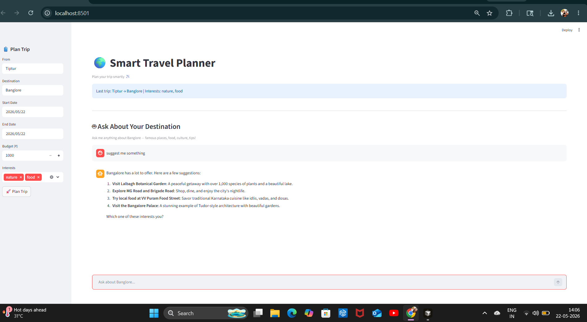
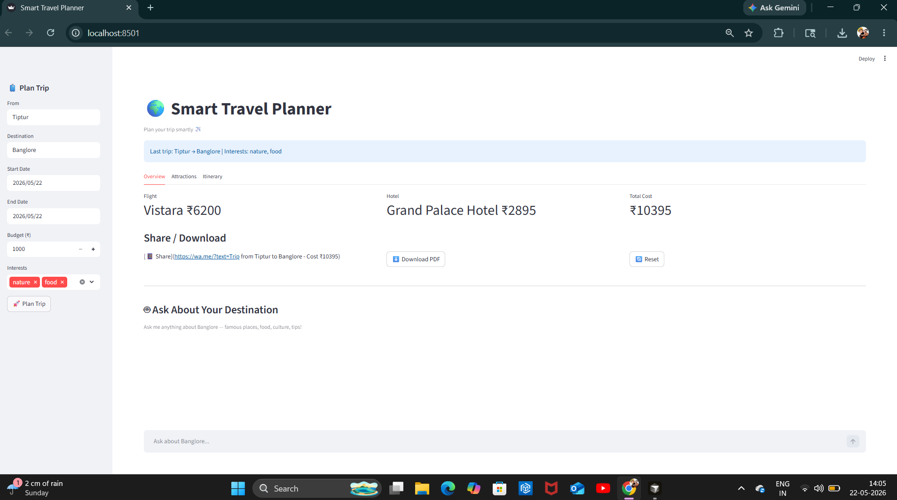
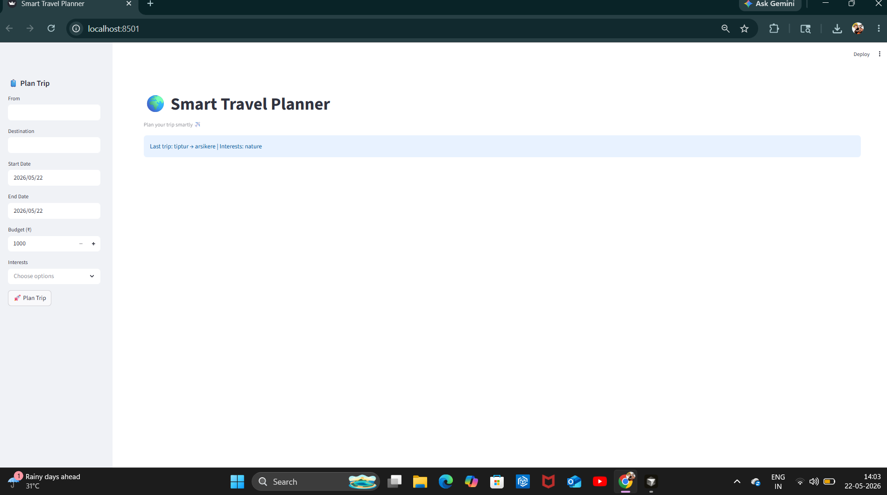

# AI-Powered Oral Cancer Detection System (OSCC AI)

[](https://fastapi.tiangolo.com/)
[](https://pytorch.org/)
[](https://react.dev/)
[](https://tailwindcss.com/)

An end-to-end clinical AI screening and triage platform designed for early, non-invasive detection of Oral Squamous Cell Carcinoma (OSCC) from clinical photographs. The application integrates deep learning ensemble architectures with epistemic uncertainty quantification, patient risk factor assessment, and an intuitive modern web interface.

---

## System Architecture & CNN Pipeline

### System Architecture


### CNN Data Flow & Triage Workflow


---

## Application Showcase

The web client provides a responsive user experience with Dark/Light modes, real-time risk stratification, uncertainty quantification, and automated PDF clinical reporting.

| Landing Page | Screening / Upload Portal |
| :---: | :---: |
|  |  |

| AI Analysis & Uncertainty | Clinical Risk Stratification |
| :---: | :---: |
|  |  |

| Patient History & Analytics | Detailed Diagnostic Report |
| :---: | :---: |
|  |  |

---

## Key Features

- **Multi-Model Deep Learning**: CNN ensemble (VGG16, ResNet50, EfficientNet, MobileNet) with Monte Carlo Dropout for epistemic uncertainty estimation.
- **Multimodal Risk Stratification**: Fuses visual feature extraction with patient lifestyle factors (tobacco, alcohol, betel nut usage, lesion duration).
- **Automated PDF Reports**: Instant generation of clinical triage reports with patient info, confidence scores, and visual overlays.
- **Interactive Presentation Deck**: Built-in high-end presentation deck ([presentation.html](presentation.html)) powered by Reveal.js.
- **Secure Authentication**: JWT-based session security with bcrypt password hashing and user profiles.

---

## Project Directory Structure

```
ORC/
├── assets/
│   ├── diagrams/                  # System, CNN dataflow, and methodology diagrams
│   │   ├── system_architecture.png
│   │   ├── data_flow.png
│   │   ├── methodology.png
│   │   └── tech_stack.png
│   └── screenshots/               # Application UI presentation screenshots
│       ├── s1.png ... s6.png
│
├── backend/                       # FastAPI Server & PyTorch Inference Engine
│   ├── app/                       # Modular Enterprise Clean Architecture
│   │   ├── api/                   # Versioned REST endpoints (predict, auth, history, fhir, active learning)
│   │   ├── core/                  # Security, rate limiting, and configuration
│   │   ├── db/                    # Session management and live migrations
│   │   ├── models/                # SQLAlchemy relational models
│   │   ├── schemas/               # Pydantic validation schemas
│   │   └── services/              # Dual-stage vision, AJCC staging, longitudinal tracker, FHIR exporter
│   ├── tests/                     # 42-test automated pytest suite
│   ├── main.py                    # Application entrypoint
│   ├── merged_model.pth           # Deep learning ensemble model weights
│   ├── requirements.txt           # Python dependency specifications
│   └── Dockerfile                 # Production hardened container definition
│
├── frontend/                      # React.js Single Page Application
│   ├── public/                    # Static assets, index.html, icons
│   ├── src/                       # React components, clinical workstations, and styles
│   ├── package.json               # Node.js dependencies and scripts
│   └── tailwind.config.js         # Tailwind styling configuration
│
├── docs/                          # Comprehensive Technical & Academic Documentation
│   ├── academic_synopsis.md       # Full academic project synopsis & background
│   ├── project_details.md         # Team details, project guidance, and tech breakdown
│   ├── PRD.md                     # Product Requirements Document
│   ├── TRD.md                     # Technical Requirements Document
│   ├── APP_FLOW.md                # Sequence diagrams & application workflow
│   ├── BACKEND_SCHEMA.md          # Database schema & entity-relationship diagrams
│   ├── FRONTEND_GUIDELINES.md     # UI/UX design rules and clinical disclaimers
│   ├── IMPLEMENTATION_PLAN.md     # Architecture implementation roadmap
│   └── TECHNICAL_STACK.md         # Deep-dive into models and algorithms
│
├── presentation.html              # Interactive Reveal.js presentation deck
└── README.md                      # Project documentation and setup guide
```

---

## Documentation Index

Explore detailed documentation in the [`docs/`](docs/) directory:

- [Academic Synopsis](docs/academic_synopsis.md) - Problem statement, literature review, and clinical objectives.
- [Project Details](docs/project_details.md) - Project guides, contributors, and detailed module breakdowns.
- [Product Requirements Document (PRD)](docs/PRD.md) - Clinical boundaries, triage rules, and user personas.
- [Technical Requirements Document (TRD)](docs/TRD.md) - Security, API contracts, latency budgets, and deployment targets.
- [Application Flow & Sequence](docs/APP_FLOW.md) - End-to-end user workflows and sequence diagrams.
- [Backend Schema & ERD](docs/BACKEND_SCHEMA.md) - Relational database schemas & indices.

---

## Environment Variables Configuration

Copy `backend/.env.example` to `backend/.env` before starting the service:

```bash
cp backend/.env.example backend/.env
```

| Variable | Description | Default / Example |
| :--- | :--- | :--- |
| `ENVIRONMENT` | Environment tier (`development` or `production`) | `development` |
| `DATABASE_URL` | PostgreSQL or SQLite connection string | `sqlite:///oralcancer.db` |
| `SECRET_KEY` | High-entropy secret for JWT signature verification | *Required in production* |
| `CORS_ORIGINS` | Comma-delimited list of allowed browser origins | `http://localhost:3000,http://localhost:8000` |
| `PORT` | Uvicorn server port | `8000` |

---

## Security Architecture & Clinical Privacy

- **Zero-Wildcard CORS**: Production origins are restricted to explicit whitelist domains.
- **Defensive Cryptography**: Passwords protected with PBKDF2-HMAC-SHA256 (390,000 iterations); startup validation blocks weak default keys in production.
- **PHI Leakage Prevention**: All clinical metadata is submitted strictly via multipart body payloads, keeping patient records out of query logs and browser history.
- **Enterprise Headers**: Strict CSP, `Cache-Control: no-store` on diagnostic endpoints, `X-Frame-Options: DENY`, `X-Content-Type-Options: nosniff`, and `Strict-Transport-Security`.

---

## Quickstart Guide

### 1. Backend Setup

The backend runs on Python 3.11 with FastAPI and PostgreSQL / SQLite with automated startup migrations.

```bash
cd backend

# Install dependencies (or activate your virtual environment)
pip install -r requirements.txt

# Run automated backend test suite (46 unit, integration, and security tests)
python -m pytest tests/ -v

# Start the API server
python -m uvicorn app.main:app --reload --port 8000
```
Backend Swagger API documentation will be available at: [http://localhost:8000/docs](http://localhost:8000/docs).

### 2. Frontend Setup

```bash
cd frontend

# Install Node dependencies
npm install

# Run automated frontend test suite
npm test -- --watchAll=false

# Start development server
npm start
```
The application will open at: [http://localhost:3000](http://localhost:3000).

### 3. Interactive Slide Presentation

Open [presentation.html](presentation.html) directly in any modern web browser to view the interactive Reveal.js presentation deck with live diagrams and project milestones.