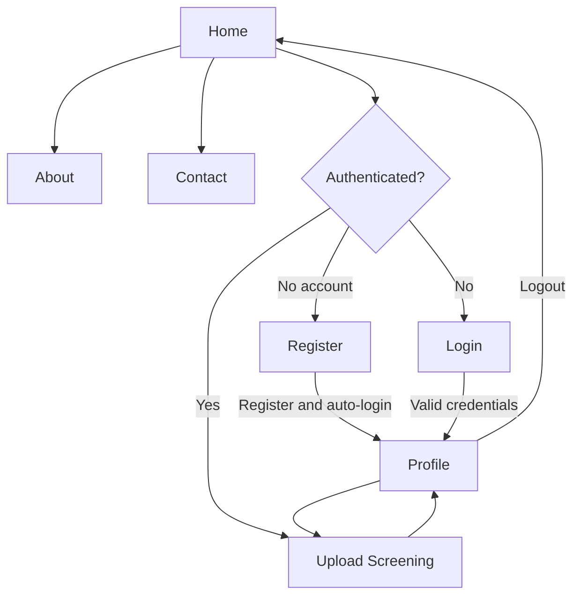
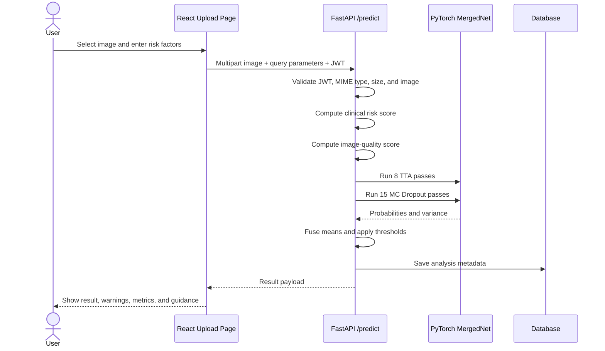
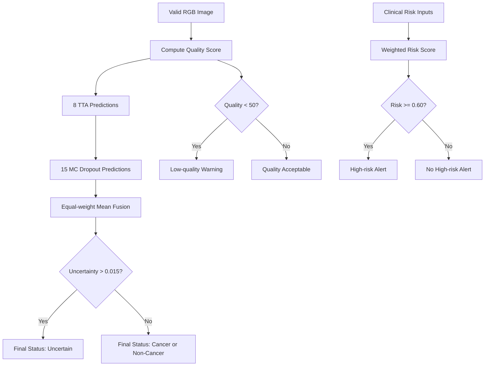

# Application Flow

## Navigation Flow

## Registration Flow

1. User opens `/register`.
2. User enters full name, username, email, and password.
3. Frontend sends JSON to `POST /register`.
4. Backend validates username, password, and email; checks duplicates; hashes password; creates user.
5. Frontend immediately sends form-encoded credentials to `POST /login`.
6. JWT is saved in `localStorage`.
7. User is routed to `/profile`.

Failure states:

- Invalid field values
- Duplicate username
- Duplicate email
- Backend unavailable

## Login Flow

1. User opens `/login`.
2. User enters username or email and password.
3. Frontend sends OAuth2 form data to `POST /login`.
4. Backend tries exact username, case-insensitive username, then email.
5. Backend verifies account is active and password is valid.
6. Backend returns a 60-minute JWT.
7. Frontend stores the token and routes to `/profile`.

Current limitation: logout removes the local token but does not revoke it server-side.

## Screening Flow

### Screening Decision Flow

## Risk Score Flow

1. Start at `0.0`.
2. Add `0.15` for age 40-59 or `0.30` for age 60+.
3. Add `0.35` for tobacco use.
4. Add `0.20` for alcohol use.
5. Add `0.30` for betel-nut use.
6. Add `0.25` for prior oral lesions.
7. Cap score at `1.0`.
8. Set high-risk alert when score is at least `0.60`.

The clinical score is displayed beside, but is not mathematically fused into, the image-model probability.

## Result And Report Flow

1. UI maps result to cancer, non-cancer, or uncertain styling.
2. UI displays low-quality and high-clinical-risk badges when applicable.
3. UI displays confidence, uncertainty, and risk score.
4. UI overlays a simulated radial color visualization on the preview; this is not true Grad-CAM.
5. User can generate a PDF by rendering the result panel with `html2canvas` and saving it with `jsPDF`.

## Profile Flow

1. Protected profile page fetches:
   - `GET /me`
   - `GET /me/analyses`
2. User can edit full name and email.
3. Frontend sends updates to `POST /me/update`.
4. Analysis history is displayed newest first.

Current limitation: profile membership date is hard-coded in the UI rather than using `created_at`.

## Error And Edge Flows

| Scenario | Current Behavior | Desired Behavior |
|---|---|---|
| No token | Protected route redirects to login | Preserve intended destination |
| Expired token | API returns 401 | Clear session-expired message and redirect |
| Unsupported file | Backend returns 400 | Frontend should prevent and explain |
| File over 10 MB | Backend returns 413 | Frontend should validate before upload |
| Corrupt image | Backend returns 400 | Prompt user to choose another image |
| Low-quality image | Analysis continues with warning | Strongly encourage retake before relying on result |
| High uncertainty | Final status becomes uncertain | Recommend specialist review |
| High clinical risk | Alert shown beside image result | Recommend screening regardless of image result |
| Backend/model unavailable | Error displayed | Provide retry and support path |

## Public Information Flow

- Home markets the product and links to screening/about.
- About presents team, advisor, dataset, and accuracy claims.
- Contact displays contact details and a form.

Before public use, all factual claims and contact workflows must be verified. The current contact form does not submit data.

