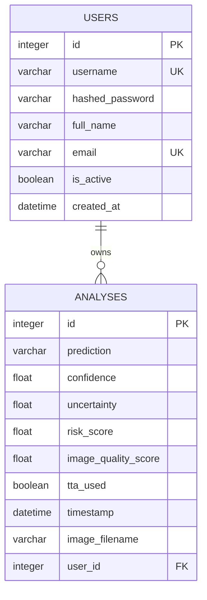

# Backend Schema

## Persistence Overview

The backend uses SQLAlchemy. The default database is SQLite at `backend/oralcancer.db`; a different SQLAlchemy database can be supplied through `DATABASE_URL`.

Current database snapshot:

- `users`: 30 rows
- `analyses`: 49 rows

These counts describe the checked-in development database and are not product metrics.

## Entity Relationship Diagram



## Current Tables

### `users`

| Column | ORM Type | Nullable | Intended Constraint | Notes |
|---|---|---|---|---|
| `id` | Integer | No | Primary key | Indexed by ORM |
| `username` | String | Current DB permits null | Unique, indexed | Required by API |
| `hashed_password` | String | Current DB permits null | Required | PBKDF2-SHA256 or legacy bcrypt |
| `full_name` | String | Yes | Max 100 recommended | Optional in backend registration |
| `email` | String | Yes | Unique, indexed | Basic `@` validation only |
| `is_active` | Boolean | Yes in migrated DB | Default true | Null legacy values treated as active |
| `created_at` | DateTime | Yes in migrated DB | Default UTC | Added by ad hoc migration |

### `analyses`

| Column | ORM Type | Nullable | Intended Constraint | Notes |
|---|---|---|---|---|
| `id` | Integer | No | Primary key | |
| `prediction` | String | Current DB permits null | Enum recommended | `cancer`, `non_cancer`, or `uncertain` |
| `confidence` | Float | Current DB permits null | 0-1 | Maximum fused probability |
| `uncertainty` | Float | Yes | >= 0 | Maximum MC Dropout variance |
| `risk_score` | Float | Yes | 0-1 | Deterministic clinical score |
| `image_quality_score` | Float | Yes | >= 0 | Laplacian variance |
| `tta_used` | Boolean | Yes | Default false | Current predictions store true |
| `timestamp` | DateTime | Yes | Default UTC | |
| `image_filename` | String | Yes | Length limit recommended | Image content is not stored |
| `user_id` | Integer | Yes in current DB | Foreign key, required recommended | References `users.id` |

## Pydantic Request And Response Schemas

### `UserCreate`

```json
{
  "username": "string, 3-50 chars",
  "password": "string, minimum 6 chars",
  "full_name": "optional string",
  "email": "optional string containing @"
}
```

### `UserUpdate`

```json
{
  "full_name": "optional string",
  "email": "optional string"
}
```

### `ClinicalRiskForm`

```json
{
  "age": "integer, 5-110",
  "tobacco_use": false,
  "alcohol_use": false,
  "betel_nut": false,
  "prior_lesions": false
}
```

### `AnalysisInfo`

```json
{
  "id": 1,
  "prediction": "uncertain",
  "confidence": 0.71,
  "uncertainty": 0.019,
  "risk_score": 0.55,
  "image_quality_score": 42.3,
  "timestamp": "datetime",
  "image_filename": "example.jpg"
}
```

## Recommended Schema Changes

### Strengthen Existing Columns

- Make required fields `NOT NULL`.
- Enforce username and normalized email uniqueness.
- Add explicit length constraints.
- Add check constraints for all 0-1 scores.
- Enforce foreign keys and choose deletion behavior.
- Use timezone-aware timestamps.

### Expand `analyses`

Add:

| Column | Purpose |
|---|---|
| `raw_prediction` | Preserve model class before uncertainty override |
| `final_status` | Preserve final screening status |
| `model_version` | Trace result to exact model artifact |
| `inference_config_version` | Trace thresholds/TTA/MCD configuration |
| `image_quality_status` | Preserve acceptable/low-quality decision |
| `clinical_alert` | Preserve high-risk decision |
| `age` and risk-factor booleans | Make historical risk score auditable |
| `guidance_code` | Record user guidance displayed |
| `created_at` | Standardized creation time |
| `consent_version` | Trace consent accepted for screening |

### Optional New Tables

#### `model_versions`

- Version, artifact checksum, class order, thresholds, deployment date, metrics URI, active status.

#### `audit_events`

- Actor, event type, object, timestamp, request ID, and minimal non-sensitive metadata.

#### `refresh_tokens` or `sessions`

- Only if implementing revocable sessions or refresh-token rotation.

## Migration Strategy

The current `_safe_migrate()` function adds columns directly and has limited portability and rollback support. Replace it with Alembic:

1. Baseline the current schema.
2. Add constraints and new columns in staged migrations.
3. Backfill legacy rows.
4. Verify SQLite and PostgreSQL behavior.
5. Remove `_safe_migrate()` after deployment migration succeeds.

## Data Retention

- Uploaded image bytes are currently processed in memory and discarded.
- Original filename and result metadata are retained indefinitely.
- Define retention periods and user deletion/export workflows before production use.
- Avoid storing images unless there is explicit consent, a clinical need, access control, encryption, and a retention policy.

