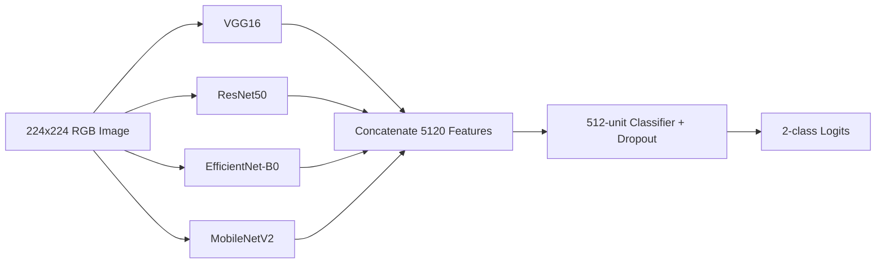

# Technical Stack

## Current Stack

| Layer | Technology | Repository Evidence | Notes |
|---|---|---|---|
| Frontend language | JavaScript / JSX | `frontend/src/*.js` | No TypeScript |
| Frontend framework | React 19.1 | `frontend/package.json` | Single-page application |
| Routing | React Router DOM 7.6 | `App.js` | Public and protected routes |
| Styling | Tailwind CSS 3.4 | `tailwind.config.js`, `index.css` | Class-based dark mode |
| Animation | Framer Motion 12.19 | UI components | Page, card, and interaction animation |
| Icons | Lucide React | UI components | SVG icon library |
| HTTP client | Axios 1.10 | Login, register, upload, profile | API URL is hard-coded |
| File upload UI | React Dropzone 14.3 | `Upload.js` | Single-image selection |
| PDF generation | jsPDF + html2canvas | `Upload.js` | Runs in browser |
| Frontend build | Create React App + CRACO | `package.json`, `craco.config.js` | PostCSS/Tailwind integration |
| Backend language | Python | `backend/*.py` | Main API is one module |
| API framework | FastAPI | `backend/main.py` | OpenAPI docs available by default |
| Server | Uvicorn | `requirements.txt` | ASGI runtime |
| ORM | SQLAlchemy | `main.py` | Declarative models |
| Default database | SQLite | `oralcancer.db`, `DATABASE_URL` default | PostgreSQL can be configured |
| PostgreSQL driver | psycopg2-binary | `requirements.txt` | Optional deployment database |
| Authentication | OAuth2 bearer + JWT | FastAPI security, python-jose | HS256, 60-minute token |
| Password hashing | PBKDF2-SHA256 + legacy bcrypt verify | `main.py` | PBKDF2 implemented with stdlib |
| Rate limiting | SlowAPI | `main.py` | Missing from requirements file |
| ML framework | PyTorch + Torchvision | `main.py`, `train.py` | CNN ensemble |
| Image processing | Pillow + NumPy | `main.py` | NumPy missing from requirements |
| Training evaluation | scikit-learn, matplotlib, seaborn | `train.py` | Missing from requirements |

## Model Stack

The deployed model is a frozen-feature ensemble:



Inference adds:

- 8-pass test-time augmentation
- 15-pass Monte Carlo Dropout
- Approximate Laplacian-variance image-quality score
- Deterministic clinical risk score

## Configuration

| Setting | Current Source | Recommended Source |
|---|---|---|
| Backend database URL | `DATABASE_URL` with SQLite fallback | Environment / secret manager |
| JWT secret | `SECRET_KEY` with insecure fallback | Required secret manager value |
| Frontend API URL | Hard-coded localhost strings | `.env` / deployment config |
| Model path | Fixed beside `main.py` | Environment with validated checksum |
| Thresholds | Constants in `main.py` | Versioned model configuration |
| CORS origins | Wildcard | Environment allowlist |

## Dependency Gaps

`backend/requirements.txt` does not fully reproduce the backend and training environment. Add at least:

```text
slowapi
numpy
requests
scikit-learn
matplotlib
seaborn
```

Pin versions or generate a lock file after verifying compatibility.

## Recommended Production Stack

| Concern | Recommendation |
|---|---|
| Backend packaging | Docker image with pinned Python dependencies |
| Database | Managed PostgreSQL with Alembic migrations |
| Frontend hosting | Static build behind CDN |
| API ingress | Reverse proxy/API gateway with HTTPS |
| Secrets | Cloud secret manager or protected environment variables |
| Object storage | Only if image retention is approved and consented |
| Observability | Structured logs, metrics, tracing, error monitoring |
| CI/CD | Lint, unit, API, frontend, model smoke, and security checks |
| Model governance | Versioned artifact, checksum, metrics card, rollback |

## Stack Decisions To Preserve

- FastAPI is appropriate for typed API contracts and ML inference.
- PyTorch/Torchvision match the current model artifact.
- React and Tailwind provide a workable responsive UI foundation.
- SQLAlchemy keeps SQLite development and PostgreSQL deployment possible.

## Stack Decisions To Revisit

- Create React App is aging; consider Vite during a planned frontend modernization.
- A monolithic `main.py` should be split before expanding features.
- Browser `localStorage` is not ideal for sensitive authenticated workflows.
- Client-side PDF rendering is convenient but not authoritative or tamper-resistant.
- The alternate EfficientNet-B4 training script should be separated or clearly marked because its weights cannot be loaded by deployed `MergedNet`.

