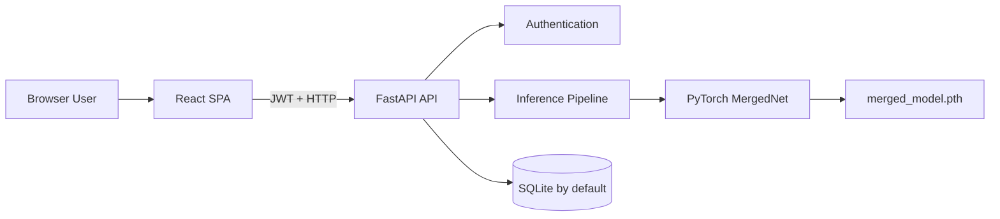

# Technical Requirements Document

## System Overview

The repository implements a two-tier web application:

- React single-page application in `frontend/`
- FastAPI API, PyTorch inference, and SQLAlchemy persistence in `backend/`



## Repository Components

| Component | Primary Files | Responsibility |
|---|---|---|
| Frontend shell | `frontend/src/App.js`, `Navbar.js` | Routes, token state, navigation |
| Screening UI | `frontend/src/Upload.js` | Upload, risk form, result, simulated heatmap, PDF |
| Account UI | `Login.js`, `Register.js`, `Profile.js` | Authentication and user history |
| API | `backend/main.py` | Auth, profile, prediction, database, model loading |
| Model training | `backend/train.py` | Trains the deployed four-backbone merged model |
| Alternate training reference | `backend/train_model.py` | EfficientNet-B4 reference pipeline; not compatible with deployed MergedNet weights |
| Model artifact | `backend/merged_model.pth` | Deployed state dictionary, about 189 MB |
| Dataset | `backend/data_split/` | Binary train/validation/test image folders |
| Database | `backend/oralcancer.db` | Current SQLite data |

## Runtime Requirements

### Backend

- Python 3.8+; checked-in virtual environment reports Python 3.11.
- Required packages must include all imports in `main.py`.
- `slowapi` and `numpy` are imported but missing from `backend/requirements.txt`; they must be added.
- Model file must exist at `backend/merged_model.pth`.
- Database defaults to `backend/oralcancer.db`.
- Optional environment variables:
  - `DATABASE_URL`
  - `SECRET_KEY`

### Frontend

- Node.js and npm compatible with Create React App / CRACO.
- API base URL must become environment-driven.
- Production builds must not depend on localhost.

## Machine Learning Requirements

### Deployed Architecture

`MergedNet` combines frozen feature extractors:

| Backbone | Output Features |
|---|---:|
| VGG16 features | 512 |
| ResNet50 without pooling/classifier | 2048 |
| EfficientNet-B0 features | 1280 |
| MobileNetV2 features | 1280 |
| Concatenated vector | 5120 |

Classifier:

```text
Linear(5120, 512) -> ReLU -> Dropout(0.5) -> Linear(512, 2)
```

Class order is fixed as:

```text
0 = cancer
1 = non_cancer
```

### Preprocessing And Inference

- Convert input to RGB.
- Resize to `224 x 224`.
- Normalize with ImageNet mean and standard deviation.
- Compute image sharpness using approximate Laplacian variance.
- Run 8 TTA transforms.
- Run 15 MC Dropout forward passes.
- Average TTA mean and MC Dropout mean at equal weight.
- Override predicted class to `uncertain` when variance exceeds `0.015`.

### Dataset Snapshot

| Split | Cancer | Non-Cancer | Total |
|---|---:|---:|---:|
| Train | 341 | 314 | 655 |
| Validation | 75 | 68 | 143 |
| Test | 74 | 68 | 142 |
| Total | 490 | 450 | 940 |

### Model Constraints

- Training script uses a hard-coded external Windows dataset path and must be changed to a configurable repository-relative path.
- Frozen backbones mean only the classifier is trained by `train.py`.
- There is no checked-in reproducible metric report or confusion matrix.
- Enabling `ai_model.train()` for MC Dropout also changes batch-normalization behavior, not only dropout. Production uncertainty inference should enable dropout layers selectively.
- The service loads one large model in each backend worker; multi-worker deployment multiplies memory use.

## API Requirements

| Method | Path | Auth | Rate Limit | Purpose |
|---|---|---|---|---|
| POST | `/register` | No | 5/min | Create user |
| POST | `/login` | No | 10/min | Return JWT |
| POST | `/predict` | Bearer JWT | 20/min | Run screening and persist result |
| GET | `/me` | Bearer JWT | None | Get profile |
| GET | `/me/analyses` | Bearer JWT | None | Get analysis history |
| POST | `/me/update` | Bearer JWT | None | Update name/email |
| GET | `/health` | No | None | Health response |

### Prediction Request

- Content type: `multipart/form-data`
- Required form file: `file`
- Query parameters:
  - `age`, default `30`
  - `tobacco_use`, default `false`
  - `alcohol_use`, default `false`
  - `betel_nut`, default `false`
  - `prior_lesions`, default `false`

### Prediction Response

```json
{
  "prediction": "cancer | non_cancer | uncertain",
  "confidence": 0.91,
  "uncertainty": 0.0021,
  "clinical_risk_score": 0.55,
  "clinical_alert": false,
  "image_quality": "acceptable | low_quality",
  "tta_passes": 8,
  "mc_dropout_passes": 15
}
```

## Security Requirements

- `SECRET_KEY` must be mandatory outside development.
- CORS must use an explicit allowlist; current wildcard configuration must be removed.
- Passwords use PBKDF2-SHA256 with 390,000 iterations; legacy bcrypt hashes remain supported.
- Enforce HTTPS in deployed environments.
- Add security headers and content-security policy.
- Validate decoded image dimensions and decompression-bomb risk, not only byte size.
- Avoid logging patient-sensitive details.
- Consider secure HTTP-only cookies instead of browser `localStorage`.
- Add token revocation or rotation strategy.

## Data Requirements

- Use formal database migrations rather than `_safe_migrate()` ALTER statements.
- Enable and verify foreign-key enforcement in SQLite.
- Add indexes and constraints documented in `BACKEND_SCHEMA.md`.
- Add model version, input risk factors, final guidance, and consent metadata to each analysis.
- Define retention and deletion rules.

## Quality Requirements

### Required Automated Tests

- Unit tests for risk scoring, password hashing, quality scoring, and uncertain threshold.
- API tests for every endpoint and failure mode.
- Model smoke test using a fixed fixture.
- Frontend component tests for auth, upload, result states, and history.
- End-to-end flow from registration to prediction history.

### Performance Targets

- Health endpoint p95 below 200 ms.
- Non-inference authenticated endpoints p95 below 500 ms.
- Prediction latency measured separately for CPU and GPU.
- Prevent concurrent inference from exhausting memory.

## Deployment Requirements

- Separate frontend and backend configuration by environment.
- Do not check in virtual environments, database files, datasets, or secrets for production.
- Package backend with a pinned dependency lock and model checksum.
- Use a reverse proxy and HTTPS.
- Add structured logs, metrics, alerts, backup, restore, and rollback procedures.

