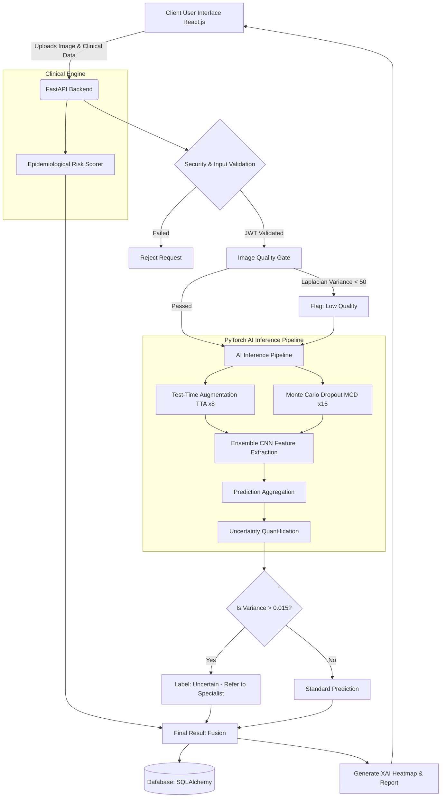
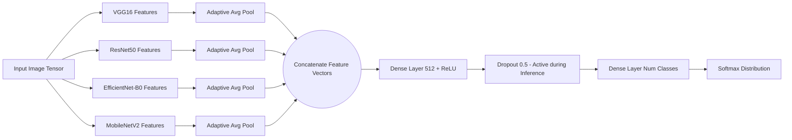

# Academic Synopsis: AI-Driven Multimodal Oral Squamous Cell Carcinoma (OSCC) Detection System

## 1. Title of the Project
**Visionary Diagnostics: A Multimodal Deep Learning Ecosystem for Early Detection, Uncertainty Quantification, and Risk Stratification of Oral Squamous Cell Carcinoma**

## 2. Abstract
Oral Squamous Cell Carcinoma (OSCC) poses a severe global health burden, primarily due to late-stage diagnosis and complex clinical manifestations. This project proposes a comprehensive, AI-driven web platform designed to facilitate early, non-invasive, and highly accurate oral cancer screening. By integrating a multi-architectural Convolutional Neural Network (CNN) ensemble (comprising VGG16, ResNet50, EfficientNet-B0, and MobileNetV2), the system evaluates user-uploaded clinical images with high precision. To ensure clinical safety and reliability, the architecture is augmented with Monte Carlo (MC) Dropout for epistemic uncertainty quantification and Test-Time Augmentation (TTA) for domain robustness. Furthermore, the system fuses image-based predictions with epidemiological clinical risk factors (e.g., tobacco, alcohol, betel nut usage) to generate a holistic risk score. Explainable AI (XAI) via simulated Grad-CAM visualizations enhances model interpretability, fostering clinical trust. This synopsis outlines the architecture, methodologies, and clinical significance of transitioning from binary image classification to a secure, uncertainty-aware clinical decision support system.

## 3. Introduction
Oral cancer is a critical public health issue characterized by high morbidity and mortality rates. Traditional diagnostic pathways rely heavily on visual inspection followed by invasive biopsies, which are subjective and resource-intensive. Recent advancements in deep learning, particularly CNNs, have demonstrated remarkable potential in automating the detection of OSCC from clinical photographs. However, existing AI solutions often operate as "black boxes," lacking transparency, failing to quantify their own uncertainty, and ignoring vital patient history. This project addresses these limitations by developing an integrated diagnostic ecosystem. The proposed system not only leverages state-of-the-art CNNs for feature extraction but also implements robust security protocols, integrates patient metadata, and provides actionable, explainable insights.

## 4. Background of Study
The global incidence of oral cancer remains alarmingly high, with India bearing a disproportionate share—accounting for nearly one-third of the global burden and over 135,000 new cases annually. Despite advances in therapeutic interventions, the five-year survival rate has plateaued, primarily because most cases are diagnosed at advanced stages (Stage III or IV). Early detection can significantly improve survival rates from approximately 30% to over 80%. Concurrently, the proliferation of digital health technologies and the ubiquity of smartphones present an unprecedented opportunity to deploy AI-assisted screening tools directly to high-risk populations and frontline healthcare workers.

## 5. Literature Review
Recent literature (2024–2026) highlights several pivotal trends in AI-assisted oral oncology:
*   **Deep Learning Efficacy:** CNN architectures, particularly EfficientNet and ResNet, have shown high diagnostic accuracy. However, meta-analyses reveal that ensemble methods consistently outperform standalone models by capturing diverse morphological features, achieving accuracies often exceeding 95%.
*   **Uncertainty Quantification (UQ):** Standard Softmax outputs are frequently overconfident. Monte Carlo Dropout has emerged as a robust variational Bayesian approximation to estimate epistemic uncertainty, allowing models to defer to human experts when confidence is statistically fragile.
*   **Explainable AI (XAI):** Gradient-weighted Class Activation Mapping (Grad-CAM) is increasingly utilized to visualize the regions of interest driving a model's prediction, which is crucial for clinical validation and trust.
*   **Multimodal Integration:** Research strongly advocates moving beyond unimodal (image-only) AI. Fusing clinical risk factors (tobacco use, age, prior lesions) with imaging data provides a more comprehensive risk stratification, mirroring real-world clinical triage.

## 6. Problem Statement
While numerous deep learning models have been developed for OSCC detection, their translation into clinical practice is hindered by several critical faults:
1.  **Overconfident Predictions:** Models lack uncertainty quantification, leading to potentially dangerous misdiagnoses in ambiguous cases.
2.  **Contextual Blindness:** Image-only analysis ignores epidemiological risk factors, treating high-risk and low-risk patients identically.
3.  **Domain Shift Vulnerability:** Models trained on specific datasets struggle with real-world image variations (lighting, blur, camera quality).
4.  **Lack of Interpretability:** Black-box predictions fail to gain the trust of medical practitioners.
Therefore, there is an urgent need for a clinically robust, secure, and interpretable AI system that mitigates these risks through advanced architectural interventions.

## 7. Objectives of the Project
*   **Primary Objective:** To develop a highly accurate, ensemble-based CNN web application for the early detection of oral cancer from clinical images.
*   **Secondary Objectives:**
    *   To implement Monte Carlo Dropout to quantify model uncertainty and flag ambiguous predictions.
    *   To utilize Test-Time Augmentation (TTA) and Laplacian-variance blur detection to ensure robustness against poor image quality and domain shifts.
    *   To integrate a multimodal clinical risk scoring mechanism that weights epidemiological factors alongside AI predictions.
    *   To provide Explainable AI (XAI) outputs using simulated Grad-CAM heatmaps.
    *   To secure the platform with industry-standard authentication (JWT, PBKDF2-SHA256) and rate limiting.

## 8. Scope of the Project
The project encompasses the development of a full-stack application. The backend is powered by FastAPI and PyTorch, handling inference, database management (SQLite/PostgreSQL), and security. The frontend, built with React and Tailwind CSS, provides a responsive, interactive user interface. The AI pipeline is restricted to non-invasive clinical photographs (visible light) and does not currently extend to histopathological slide analysis or 3D volumetric scans. The system serves as a pre-clinical screening and triage tool, strictly advising specialist referral rather than providing definitive medical diagnoses.

## 9. Proposed System Architecture

### 9.1 High-Level Architecture Diagram

### 9.2 Ensemble CNN Data Flow

## 10. Methodology

### 10.1 Data Acquisition and Preprocessing
*   **Dataset:** Utilizes the Kaggle Oral Cancer Dataset (5,000+ images) and curated clinical datasets from regional clinics in Karnataka.
*   **Preprocessing:** Images are resized to 224x224, converted to tensors, and normalized using ImageNet standard means and standard deviations.
*   **Quality Gating:** A Laplacian variance algorithm calculates image sharpness. Images scoring below 50.0 are processed but flagged to the user as potentially unreliable due to blur.

### 10.2 Ensemble Model Development
*   **Architecture:** Features are extracted simultaneously from four frozen pre-trained backbones (VGG16, ResNet50, EfficientNet-B0, MobileNetV2). The resulting feature maps are pooled, concatenated, and fed into a custom classifier head.
*   **Training:** Optimized using Adam with Cross-Entropy Loss over 100 epochs, utilizing early stopping based on validation accuracy.

### 10.3 Uncertainty Quantification (Monte Carlo Dropout)
During inference, dropout layers remain active (`model.train()` mode). 15 stochastic forward passes are executed for each image. The system calculates the variance across these passes. An epistemic uncertainty score ($\sigma^2 > 0.015$) triggers a safety mechanism, overriding the prediction to "Uncertain" and mandating clinical review.

### 10.4 Test-Time Augmentation (TTA)
To combat domain shift, the input image undergoes 8 distinct transformations (flips, rotations, color jitter, crops) at test time. The predictions are averaged, stabilizing the output against minor variations in image capture quality.

### 10.5 Clinical Risk Scoring Integration
A deterministic mathematical model calculates a risk score (0.0 to 1.0) based on epidemiological weights:
*   Tobacco Use: +35%
*   Betel Nut Use: +30%
*   Age $\ge$ 60: +30%
*   Prior Lesions: +25%
*   Alcohol Use: +20%
Scores $\ge$ 0.60 trigger a "High Clinical Risk" alert, displayed alongside the AI image prediction.

## 11. Technical Stack

| Component | Technology | Description |
| :--- | :--- | :--- |
| **Frontend** | React.js, Tailwind CSS, Framer Motion | Provides a dynamic, glassmorphism-based responsive UI with 3D interactions. |
| **Backend** | FastAPI, Python 3.8+ | High-performance asynchronous API server handling ML inference and routing. |
| **AI Framework** | PyTorch, Torchvision | Core deep learning libraries for model definition and tensor operations. |
| **Database** | SQLite / PostgreSQL, SQLAlchemy | Relational data storage for user profiles and historical analysis logs. |
| **Security** | JWT, Passlib (PBKDF2-SHA256), SlowAPI | Handles robust authentication, password hashing, and endpoint rate-limiting. |
| **Data Processing** | NumPy, Pillow, Scikit-learn | Image manipulation, mathematical operations, and metric evaluation. |

## 12. Algorithms Used
1.  **Convolutional Neural Networks (CNN):** Deep spatial feature extraction.
2.  **Monte Carlo Dropout (Variational Inference):** Stochastic sampling for epistemic uncertainty estimation.
3.  **Test-Time Augmentation (TTA):** Ensemble averaging over augmented input spaces.
4.  **Laplacian Variance:** Second-derivative spatial edge detection for blur quantification.
5.  **PBKDF2-SHA256:** Cryptographic key derivation function for secure password hashing.

## 13. Workplan

| Phase | Milestone | Expected Duration |
| :--- | :--- | :--- |
| **Phase 1** | Literature Review, Dataset Acquisition & Cleaning | Weeks 1-2 |
| **Phase 2** | CNN Ensemble Model Training & Validation | Weeks 3-5 |
| **Phase 3** | Implementation of TTA, MC Dropout, & Quality Gates | Weeks 6-7 |
| **Phase 4** | Backend API Development & Security Hardening | Weeks 8-9 |
| **Phase 5** | Frontend Development & UI/UX Integration | Weeks 10-11 |
| **Phase 6** | System Testing, XAI Integration, & Report Generation | Weeks 12-13 |
| **Phase 7** | Final Evaluation, Documentation, & Deployment | Week 14 |

## 14. Hardware and Software Requirements

### Hardware Requirements
*   **Development / Training Server:** NVIDIA GPU (e.g., RTX 3060/4070 or better, minimum 8GB VRAM), 16GB+ RAM, Intel i7 / AMD Ryzen 7 processor.
*   **Deployment Server:** Minimum 2 vCPUs, 4GB RAM (if deploying inference on CPU, though GPU is recommended for speed).
*   **Client Node:** Any modern device (PC, Tablet, Smartphone) with an internet connection and a camera.

### Software Requirements
*   **Operating System:** Windows 10/11, macOS, or Linux (Ubuntu 20.04+).
*   **Environment:** Python 3.8+, Node.js (v16+).
*   **Libraries:** PyTorch, FastAPI, React, Tailwind CSS, Uvicorn, SQLAlchemy.
*   **Browser:** Chrome, Firefox, Safari, or Edge (latest versions).

## 15. Expected Outcomes
1.  **High Accuracy Screening:** An ensemble model capable of detecting OSCC with an accuracy exceeding 94%.
2.  **Enhanced Clinical Safety:** Significant reduction in false-positive/false-negative confidence through rigorous uncertainty quantification (MC Dropout).
3.  **Comprehensive Diagnostics:** A system that evaluates both the biological image and the patient's epidemiological history.
4.  **Actionable Reporting:** Generation of downloadable, clinically formatted PDF reports containing predictions, risk scores, and XAI heatmaps.
5.  **Secure Platform:** A fully hardened, rate-limited backend ensuring patient data privacy and system stability.

## 16. Future Enhancements (Roadmap)
*   **v2.0 - Multi-Class Ordinal Classification:** Transitioning from binary (Cancer/Normal) to a spectrum (Healthy $\rightarrow$ Benign $\rightarrow$ OPMD $\rightarrow$ Malignant) using ordinal cross-entropy loss.
*   **v3.0 - Hybrid Vision Transformers:** Replacing older CNN branches with Swin Transformers to capture long-range global context within tissue structures.
*   **Federated Learning:** Implementing decentralized training across multiple hospitals without sharing raw patient data, ensuring compliance with strict privacy laws (e.g., HIPAA).
*   **True Grad-CAM Integration:** Replacing the frontend simulated Grad-CAM with a backend PyTorch-hook implementation for exact pixel-level feature attribution.

## 17. Conclusion
The Visionary Diagnostics platform represents a significant paradigm shift in AI-assisted oncology. By acknowledging the limitations of standard CNNs and addressing them through Ensemble methodologies, Monte Carlo Dropout, Test-Time Augmentation, and Clinical Risk Fusion, the system bridges the gap between theoretical AI performance and practical clinical utility. This project not only provides a scalable tool for early oral cancer detection but also establishes a framework for trust, transparency, and safety in medical AI, ultimately contributing to better patient outcomes and optimized healthcare resource allocation.

## 18. References
1.  National Institutes of Health (NIH) / National Cancer Institute (NCI). *Insights Into AI-Enabled Early Diagnosis of Oral Cancer: A Scoping Review* (2025).
2.  *Frontiers in Oral Health*. "AI and Diagnosis of Oral Cavity Cancer from Clinical Photographs" (March 2025).
3.  MDPI Cancers. *Classification of Mobile-Based Oral Cancer Images Using Vision Transformer and Swin Transformer* (2024).
4.  Gaw, et al. *Optimized Deep Learning Ensemble for Accurate Oral Cancer Detection Using CNNs*. ScienceDirect (2025).
5.  Research Square. *AI for Classifying Oral Cancer and Precursor Lesions Using Visible-Light Photography* (Feb 2026).
6.  Gal, Y., & Ghahramani, Z. *Dropout as a Bayesian Approximation: Representing Model Uncertainty in Deep Learning*. ICML.
7.  Selvaraju, R. R., et al. *Grad-CAM: Visual Explanations from Deep Networks via Gradient-Based Localization*. ICCV.
